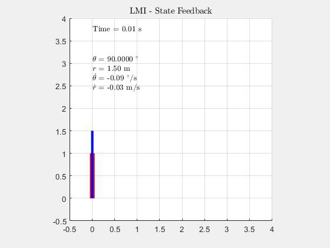
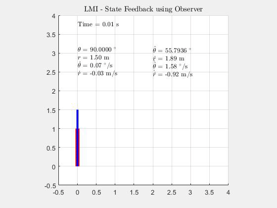

# Controlling a R-  Nonlinear Robot Manipulator
The equation of motions of the system are:  
## Linearizing the model
The problem statement is to control a Theta-R Robot Manipulator. Since the model is non-linear, to control the robot using linear control methods and techniques we linearize the system about a equillibrium point. The equillibrium point for all the simulation is [pi/4  2  0  0]'. 

## Controller Design by Pole Placement
### [State Feedback](StateFeedback_1.m)
After linearization we obtain the state matrices, the eigen values of theses matrices lie in the right half plane indicating that the open loop system is unstable. We use the place command in matlab to place poles of the clodes loop system in the left half plane. The control input is given by (U-Ue) = K*(X-Xe) because the equllibrium point is non zero. The linear controller is then implemented to control the non-linear system and an animation is generated.  

### [Observer Compensator](ObserverControllerCompensator_1.m)
We assume a scenario where we do not have sensors to measure all our states of the system, we implement a luenberger observer to estimate the states. Since our observer is linear, we again have to sybtract Ye and Ue before we feed the output and control input to the observer. We use pole placement to place the poles of (A-LC) in left half plane. As rule of thumb choose the observer poles 2-6 times faster than system poles. Since we havecomplete contrl over the observer we choose any initial condition. For comparison we select it as [0 0 0 0]' for all the codes.

## Controller Design using Linear Matrix Inequalities(LMIs)
We use the [CVX](http://cvxr.com/cvx/) solver for solving LMIs, one can also use the Robust Control Toolbox from MATLAB.
### [State Feedback](LMI_StateFeedback_1.m)
We use the lyapunov theory to form a matrix inequality and use congruence transformation to convert this into a Linear Matrix Inequality. This is then appended with a another linear term to ensure faster convergence.

### [Optimal State Feedback](LMI_OptimalStateFeedback_1.m)
We frame the Countinous Algebraic Ricatti Equation as an LMI and solve for feedback gain.  

### [Observer Compensator](LMI_ObserverControllerCompensator_1.m)
We use the lyapunov theory to form a matrix inequality and use congruence transformation to convert this into a Linear Matrix Inequality. This is then appended with a another linear term to ensure faster convergence. We make the convergence of the observer 4 times faster than the state feedback. We initialise the observer at [0 0 0 0]'

## Model Predictive Controller
### [Unconstranied MPC]()

<!--- #### [Unconstrained MPC with Observer]()
 --->
